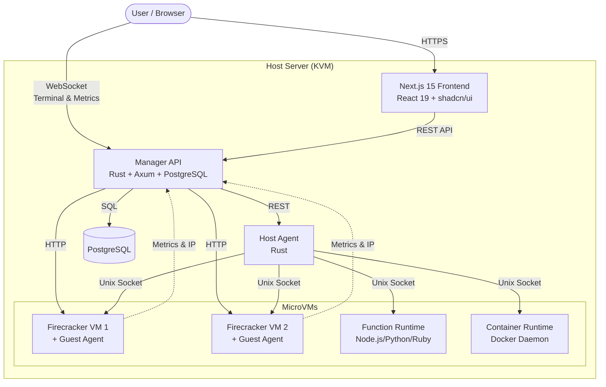

<div align="center">

# NQRust-MicroVM
### The Modern Firecracker Orchestrator

<p>
  
  
  
  
</p>

<p align="center">
  A complete cloud platform built on <b>Firecracker microVMs</b>.<br/>
  Manage VMs, containers, and serverless functions with the safety of KVM,<br/>
  the speed of Rust, and the elegance of a modern React 19 UI.
</p>

<p align="center">
  <b>✨ Production-Ready Features:</b><br/>
  VM Lifecycle • Serverless Functions • Docker Containers<br/>
  Real-time Terminal • Live Metrics • Network & Volume Management<br/>
  Multi-Host Clustering • User Management & RBAC • Snapshots & Templates
</p>

[View Demo](http://localhost:3000) • [Documentation](#-documentation--resources) • [Report Bug](https://github.com/yourusername/nqrust-microvm/issues)

</div>

---

## ⚡ Overview

**NQRust-MicroVM** is a production-ready cloud platform built on AWS Firecracker. It provides complete VM lifecycle management, serverless functions, and Docker containers with strong isolation. Built with Rust for performance and reliability, featuring a modern Next.js 15 frontend with real-time monitoring, WebSocket terminal access, and comprehensive infrastructure management.

**Perfect for:** Home labs, private clouds, development environments, and edge computing scenarios where you need the performance of bare metal with the flexibility of VMs.

### 🆕 Latest Features (2026)

* **Next.js 15 + React 19 UI**: Modern, responsive interface with shadcn/ui and Tailwind CSS 4
* **Network Registry**: Central network management with VLAN support and auto-registration
* **Volume Registry**: Track all VM volumes with attachment management
* **User Management**: Full authentication system with RBAC (Admin/Viewer/User roles)
* **Container Management**: Run Docker containers in isolated Firecracker VMs with full lifecycle control
* **Function Playground**: Test and debug serverless functions with Monaco editor and live logs
* **Host Monitoring**: Real-time metrics from all compute hosts (CPU, memory, network, uptime)
* **Auto-Refresh**: Configurable per-user dashboard auto-refresh intervals
* **WebSocket Metrics**: Live streaming of VM metrics with interactive charts
* **Template Support**: Backend complete, UI in development

### ✨ Key Features

| Feature | Description |
| :--- | :--- |
| **⚡ Serverless Functions** | Deploy **Lambda-like functions** (Node.js, Python, Ruby) in milliseconds with strong isolation and real-time execution logs. |
| **🚀 Instant VMs** | Boot Linux kernels in **<125ms** with minimal memory overhead. Full lifecycle management with start, stop, pause, resume. |
| **🐳 Container Runtime** | Run **Docker containers** with full Docker API compatibility in isolated microVMs. Each container gets its own Firecracker VM. |
| **🖥️ Web Terminal** | Full browser-based shell access via WebSocket with xterm.js (no SSH client needed). Real-time terminal in your browser. |
| **📊 Real-time Metrics** | Live CPU, memory, network, and disk metrics via WebSocket. Guest agent provides in-VM statistics. |
| **🌐 Network Management** | Central **network registry** with VLAN support (802.1Q). Auto-registration of networks during VM creation. |
| **💾 Volume Registry** | Central **volume tracking** with attachment management. Auto-discovery of rootfs volumes and drive attachments. |
| **🏢 Multi-Host** | **Host clustering** with real-time metrics monitoring. Manage multiple compute hosts from a single dashboard. |
| **👥 User Management** | Built-in **authentication** with role-based access control (Admin/Viewer/User). Resource ownership tracking. |
| **📸 Snapshots** | Capture exact VM states (full/differential) and restore them instantly. Create new VMs from snapshots. |
| **📦 Image Registry** | Central registry for kernels, rootfs images, and Docker images. Import from local paths, URLs, or DockerHub. |
| **📋 Templates** | Save VM configurations as templates for quick deployment. Backend fully implemented, UI in progress. |
| **🔐 Auto-Auth** | Automatic root credentials injection via MMDS and `cloud-init`. Support for multiple Linux distributions. |

---

## 📦 Platform Modules

### 🖥️ Compute Engine
* **MicroVMs**: Full Kernel-based Virtual Machines (KVM) powered by Firecracker with <125ms boot times
* **Functions**: Serverless execution environment for Node.js, Python, and Ruby with isolated microVMs per function
* **Containers**: Docker-compatible runtime with full Docker Remote API support. Each container runs in its own Firecracker VM
* **Guest Agent**: Auto-deployed metrics agent providing real-time CPU, memory, load, and process statistics from inside VMs

### 🌐 Network & Infrastructure
* **Network Registry**: Central management of bridge networks with VLAN support (802.1Q tagging)
* **Auto-Discovery**: Networks automatically registered when VMs are created
* **Host Clustering**: Multi-host support with real-time metrics (CPU, memory, network, uptime)
* **Bridge Networking**: NAT and bridged modes for VM connectivity with external network access

### 💾 Storage & Data
* **Volume Registry**: Central tracking of all VM volumes with attachment management
* **Image Registry**: Manage kernels, rootfs images, and Docker images. Import from local paths, URLs, or DockerHub
* **Snapshots**: Full and differential snapshots with instant restore. Create new VMs from snapshot states
* **Persistent Storage**: Attach multiple drives to VMs with ext4, qcow2, and raw format support

### 👥 Users & Access Control
* **User Management**: Create and manage users with email-based authentication
* **Role-Based Access**: Admin (full access), Viewer (read-only), User (own resources)
* **Resource Ownership**: Track which user created each resource (VMs, functions, containers)
* **Preferences**: Per-user settings including auto-refresh intervals and dashboard preferences

### 🎨 Modern Web UI
* **Dashboard**: Real-time overview of all VMs, functions, containers, and hosts
* **VM Detail**: 7-tab interface (overview, terminal, metrics, storage, network, snapshots, config)
* **Function Editor**: Browser-based Monaco editor with syntax highlighting and live testing
* **Container Management**: Full lifecycle management with logs and statistics
* **Real-time Terminal**: WebSocket-based terminal with xterm.js (no SSH needed)
* **Live Metrics**: WebSocket streaming of CPU, memory, network, and disk metrics with charts

---

## 🏗️ Architecture

The system is composed of four lightweight components:

### Components

1. **Manager** (Rust/Axum) - Central orchestration service
   - VM lifecycle management, containers, and serverless functions
   - PostgreSQL database for state persistence
   - WebSocket support for terminal and metrics streaming
   - Image registry and DockerHub integration
   - Port: 18080 (default)

2. **Agent** (Rust) - Runs on each KVM host
   - Executes VM operations via Firecracker
   - Registers with manager on startup, sends heartbeats
   - Proxies shell access via screen sessions
   - Requires root/KVM permissions
   - Port: 9090 (default)

3. **Guest Agent** (Rust) - Runs inside each VM
   - Auto-deployed during VM creation
   - Reports CPU, memory, load, process metrics
   - Auto-discovers and reports VM IP address
   - Supports systemd, OpenRC, sysvinit
   - Port: 9000 (inside VM)

4. **Frontend** (Next.js 15/React 19) - Modern web interface
   - Built with shadcn/ui and Tailwind CSS 4
   - TanStack Query for state management
   - Real-time terminal and metrics via WebSocket
   - Port: 3000 (development)



---

## 🎨 Web UI Features

The Next.js 15 frontend provides a comprehensive management interface:

### Dashboard & Monitoring
* **Unified Dashboard**: Real-time overview of VMs, functions, containers, and hosts
* **Resource Cards**: Quick stats with running/total counts for each resource type
* **Resource Table**: Sortable, searchable table combining all workloads
* **Auto-Refresh**: Configurable auto-refresh intervals (per-user preference)
* **RBAC Integration**: Role-based views (Admin/Viewer/User)

### Virtual Machine Management
* **VM List**: Searchable, filterable table with state indicators
* **Creation Wizard**: 5-step guided VM creation flow
* **VM Detail Page** (7 tabs):
  - **Overview**: VM info, state, CPU/memory, control buttons (start/stop/pause/resume)
  - **Terminal**: Full web-based shell with xterm.js (no SSH needed)
  - **Metrics**: Real-time CPU, memory, network, disk charts via WebSocket
  - **Storage**: Manage drives, attach/detach volumes
  - **Network**: Configure NICs, view assigned IPs
  - **Snapshots**: Create/restore full and differential snapshots
  - **Config**: View VM configuration (machine config, boot args)
* **State Management**: Visual state indicators (running/stopped/paused)
* **Bulk Actions**: Multi-select VMs for batch operations (planned)

### Serverless Functions
* **Function List**: View all deployed functions with runtime info
* **Monaco Editor**: Browser-based code editor with syntax highlighting
* **Multiple Runtimes**: Node.js, Python, Ruby support
* **Function Testing**: Invoke functions with custom payloads
* **Execution Logs**: Real-time logs with filtering (status, limit)
* **Function Playground**: Test and debug functions interactively

### Container Management
* **Container List**: View all containers with state and image info
* **Docker Image Browser**: Browse and import from DockerHub
* **Container Lifecycle**: Start, stop, restart, pause, resume operations
* **Real-time Logs**: Stream container logs with tail support
* **Statistics**: Live CPU and memory usage charts
* **Isolated Runtime**: Each container gets its own Firecracker VM

### Image Registry
* **Multi-Type Registry**: Kernels, rootfs images, and Docker images
* **Image Browser**: Search, filter, and view all registered images
* **Import Options**:
  - Local file upload
  - Direct path import
  - URL download
  - DockerHub browser with tag selection
* **Volume Creation**: Create blank ext4 volumes from registry
* **Image Details**: View size, type, path, and usage information

### Infrastructure Management
* **Host Monitoring**:
  - List all registered compute hosts
  - Real-time metrics (CPU, memory, network, uptime)
  - Heartbeat status indicators
  - Host detail view with statistics

* **Network Registry**:
  - Central network management
  - VLAN support (802.1Q tagging)
  - Bridge configuration (CIDR, gateway)
  - Auto-registration during VM creation
  - View VMs attached to each network

* **Volume Registry**:
  - Track all VM volumes and attachments
  - Volume creation and deletion
  - Attach/detach volumes to/from VMs
  - View volume usage and format (ext4, qcow2, raw)

### User Management & Settings
* **User Administration**: Create, update, delete users
* **Role Assignment**: Admin, Viewer, User roles
* **User Preferences**:
  - Auto-refresh intervals
  - Dashboard customization
  - Theme preferences
* **Settings Page**: Centralized user preferences and configuration

### Real-time Features
* **WebSocket Terminal**: Full xterm.js terminal with color support
* **Live Metrics**: CPU, memory, network, disk charts updating every second
* **Notifications**: Toast notifications for operations (success/error)
* **Auto-Reconnect**: Resilient WebSocket connections with retry logic

---

## 📸 Screenshots

*(Place your screenshots in a `docs/images` folder)*

| Dashboard | VM Shell |
| :---: | :---: |
|  |  |
| *Real-time resource monitoring* | *Direct WebSocket terminal access* |

---

## 🛠️ Installation Guide

<details>
<summary><b>📋 Prerequisites (Click to Expand)</b></summary>

### Hardware
* **CPU:** x86_64 with KVM support (Intel VT-x or AMD-V)
* **RAM:** 2GB+ (4GB recommended)
* **Disk:** 20GB+ free space

### Software
* Linux (Ubuntu 22.04+ recommended)
* Rust 1.70+
* Node.js 20.x
</details>

### Quick Setup

We have broken down the installation into logical steps.

<details open>
<summary><b>1. System Preparation</b></summary>

```bash
# 1. Update and install tools
sudo apt update && sudo apt install -y build-essential pkg-config libssl-dev curl git postgresql postgresql-contrib screen openssl iproute2 iptables bridge-utils

# 2. Enable KVM
sudo modprobe kvm
sudo usermod -a -G kvm $USER
# (Log out and log back in here!)

# 3. Setup Database
sudo -u postgres psql -c "CREATE DATABASE nexus;"
sudo -u postgres psql -c "CREATE USER nexus WITH ENCRYPTED PASSWORD 'your-secure-password';"
sudo -u postgres psql -c "GRANT ALL PRIVILEGES ON DATABASE nexus TO nexus;"
```
</details>

<details>
<summary><b>2. Install Firecracker & Build</b></summary>

```bash
# 1. Install Firecracker Binary
FC_VER="v1.13.1"
curl -L "https://github.com/firecracker-microvm/firecracker/releases/download/${FC_VER}/firecracker-${FC_VER}-x86_64.tgz" | tar xz
sudo mv release-${FC_VER}-x86_64/firecracker-${FC_VER}-x86_64 /usr/local/bin/firecracker

# 2. Clone & Build
git clone https://github.com/yourusername/nqrust-microvm.git
cd nqrust-microvm
cargo build --release

# 3. Run Migrations
cargo install sqlx-cli --no-default-features --features postgres
cd apps/manager && sqlx migrate run
```
</details>

<details>
<summary><b>3. Network & Storage Setup</b></summary>

```bash
# 1. Create Storage Paths
sudo mkdir -p /srv/fc/vms /srv/images
sudo chown -R $USER:$USER /srv/fc /srv/images

# 2. Configure Bridge (Choose A or B)
# Option A: NAT (Easier, Isolated)
sudo ./scripts/fc-bridge-setup.sh fcbr0 eth0

# Option B: Physical Bridge (See BRIDGED_NETWORK_SETUP.md)
```
</details>

---

## 🚀 Getting Started

### 1. Launch the Services

You need three terminal sessions (or use `systemd` services provided in `/docs`).

**Terminal 1: The Agent**
```bash
# Must start first!
./target/release/agent
```

**Terminal 2: The Manager**
```bash
./target/release/manager
```

**Terminal 3: The Frontend**
```bash
cd apps/ui
npm install && npm run dev
```

### 2. Access the Dashboard

Navigate to `http://localhost:3000` and explore the platform:

#### **Available Pages:**
* **Dashboard** - Real-time overview of all resources (VMs, functions, containers, hosts)
* **Virtual Machines** - Create and manage VMs with 5-step wizard
* **Functions** - Deploy serverless functions with built-in code editor
* **Containers** - Run Docker containers in isolated microVMs
* **Registry** - Browse and import images (kernels, rootfs, Docker images)
* **Hosts** - Monitor compute hosts with real-time metrics
* **Networks** - Manage bridge networks with VLAN support
* **Volumes** - Track VM volumes and attachments
* **Templates** - Save and deploy VM templates (UI in progress)
* **Users** - Manage users and access control
* **Settings** - User preferences and configuration

### 3. Create Your First MicroVM

1. Go to **Registry** → Import a kernel and rootfs:
   - Import from URL or local path
   - Or use [sample downloader script](scripts/download_samples.sh)

2. Click **Virtual Machines** → **New VM** and follow the 5-step wizard:
   - **Step 1**: VM name and configuration (CPU, memory)
   - **Step 2**: Set root credentials
   - **Step 3**: Machine configuration (hyperthreading, boot args)
   - **Step 4**: Select kernel and rootfs images
   - **Step 5**: Configure networking (bridge, VLAN)

3. Click **Create** and watch your VM boot in <125ms! 🚀

4. Access the VM:
   - **Terminal**: Click on VM → Terminal tab for web-based shell
   - **Metrics**: View real-time CPU, memory, network, and disk charts
   - **Snapshots**: Create full or differential snapshots
   - **Storage**: Manage drives and attach volumes
   - **Network**: Configure NICs and view assigned IPs

### 4. Deploy a Serverless Function

1. Go to **Functions** → **New Function**
2. Configure the function:
   - **Name**: my-first-function
   - **Runtime**: Node.js, Python, or Ruby
   - **Handler**: Entry point (e.g., `index.handler`)
   - **Resources**: CPU (1-2) and memory (128-512 MB)
3. Write your code in the Monaco editor (syntax highlighting included)
4. Click **Create** - the function VM will be provisioned automatically
5. Test your function:
   - Use the **Invoke** tab to send test payloads
   - View execution logs in real-time
   - Monitor function metrics and performance

### 5. Run a Docker Container

1. Go to **Containers** → **New Container**
2. Configure the container:
   - **Name**: my-app
   - **Image**: nginx:latest (or any Docker image)
   - **Resources**: CPU and memory limits
   - **Network**: Bridge configuration
3. Click **Create** - a dedicated Firecracker VM with Docker runtime will be provisioned
4. Manage the container:
   - Start/stop/restart via UI controls
   - View real-time logs
   - Monitor CPU and memory statistics
   - Each container runs in complete isolation with its own kernel

---

## 📚 Documentation & Resources

### API Documentation
Full Swagger/OpenAPI documentation is available when the manager is running:
> **http://localhost:18080/swagger-ui/**

### Additional Documentation
* **[CLAUDE.md](CLAUDE.md)** - Development guide and architecture overview
* **[FEATURES.md](FEATURES.md)** - Comprehensive feature matrix and integration status
* **[NETWORKING.md](NETWORKING.md)** - Network management, VLAN support, and auto-registration
* **[VOLUMES.md](VOLUMES.md)** - Volume management, storage, and attachment tracking
* **[TEMPLATES.md](TEMPLATES.md)** - VM templates feature documentation and implementation guide
* **[CONTAINER.md](CONTAINER.md)** - Container feature documentation
* **[RUN.md](RUN.md)** - Quick development commands
* **[PERFORMANCE_OPTIMIZATION.md](PERFORMANCE_OPTIMIZATION.md)** - Performance tuning guide

### Project Structure
```
apps/
├── manager/          # Central orchestration service (Rust/Axum)
├── agent/            # Host agent for Firecracker (Rust)
├── guest-agent/      # In-VM metrics agent (Rust)
├── ui/               # Primary Next.js 15 frontend
└── function-runtime/ # Function execution runtime

crates/
└── nexus-types/      # Shared types between services

scripts/
├── build-container-runtime-v2.sh  # Build container image
├── fc-bridge-setup.sh             # Network bridge setup
└── preload-docker-images.sh       # Preload common images
```

---

## 🤝 Contributing

Contributions are what make the open source community such an amazing place to learn, inspire, and create. Any contributions you make are **greatly appreciated**.

1.  Fork the Project
2.  Create your Feature Branch (`git checkout -b feature/AmazingFeature`)
3.  Commit your Changes (`git commit -m 'Add some AmazingFeature'`)
4.  Push to the Branch (`git push origin feature/AmazingFeature`)
5.  Open a Pull Request

---

## 📜 License

Distributed under the **GNU Affero General Public License v3.0**. See `LICENSE` for more information.

<div align="center">
  <sub>Built with ❤️ by the <b>Nexus Team</b>. Powered by Rust & Caffeine.</sub>
</div>
