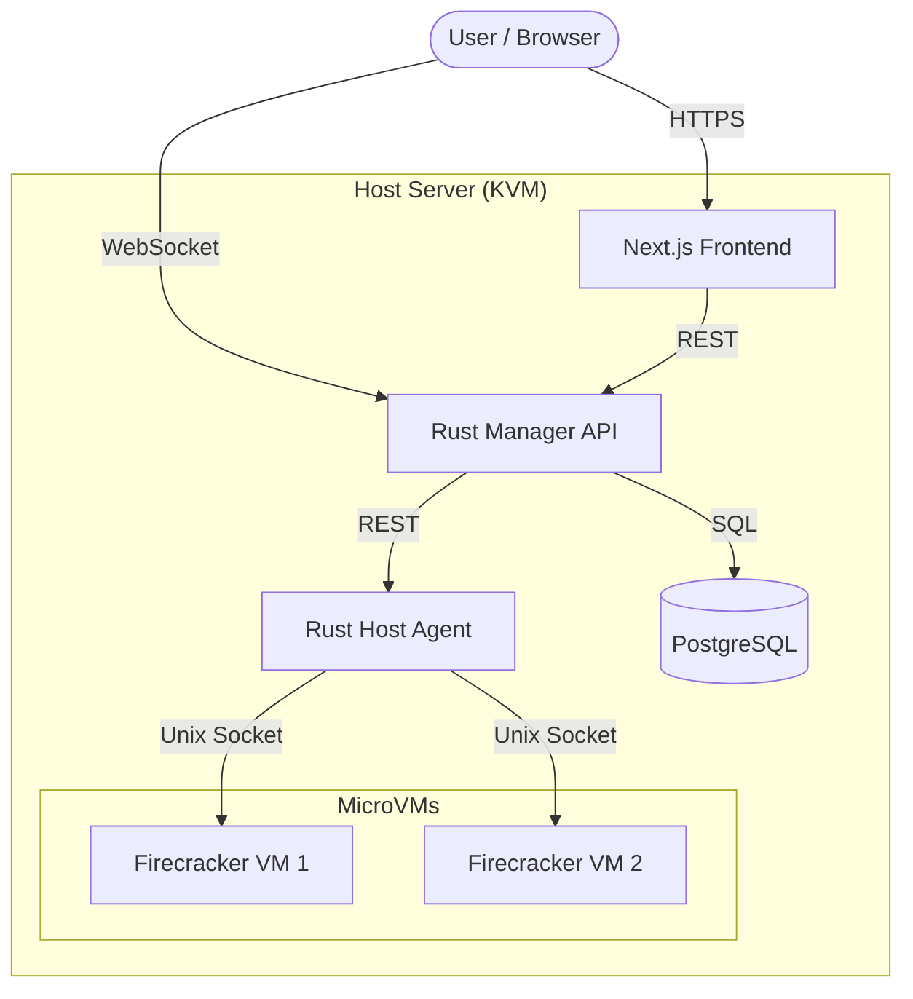

<div align="center">

# NQRust-MicroVM
### The Modern Firecracker Orchestrator

<p>
  
  
  
  
</p>

<p align="center">
  Manage <b>lightweight microVMs</b> and <b>Docker containers</b> with the safety of KVM,<br/>
  the speed of Rust, and the elegance of a modern React UI.
</p>

[View Demo](http://localhost:3000) • [Report Bug](https://github.com/yourusername/nqrust-microvm/issues) • [Request Feature](https://github.com/yourusername/nqrust-microvm/issues)

</div>

---

## ⚡ Overview

**NQRust-MicroVM** is a high-performance management system for AWS Firecracker. It bridges the gap between raw KVM processes and a usable cloud platform. Designed for home labs and private clouds, it offers a slick dashboard to spin up VMs in milliseconds.

### ✨ Key Features

| Feature | Description |
| :--- | :--- |
| **🚀 Instant VMs** | Boot Linux kernels in **<125ms** with minimal memory overhead. |
| **🐳 Container Hybrid** | Run **Docker containers** inside isolated Firecracker VMs for maximum security. |
| **🖥️ Web Terminal** | Full browser-based shell access via WebSocket (no SSH client needed). |
| **🌐 Bridged Net** | VMs appear as physical devices on your LAN (DHCP supported). |
| **📸 Snapshots** | Capture exact VM states and restore them instantly. |
| **🔐 Auto-Auth** | Automatic root credentials injection via MMDS and `cloud-init`. |

---

## 🏗️ Architecture

The system is composed of three lightweight components communicating over HTTP and WebSockets.



---

## 📸 Screenshots

*(Place your screenshots in a `docs/images` folder)*

| Dashboard | VM Shell |
| :---: | :---: |
|  |  |
| *Real-time resource monitoring* | *Direct WebSocket terminal access* |

---

## 🛠️ Installation Guide

<details>
<summary><b>📋 Prerequisites (Click to Expand)</b></summary>

### Hardware
* **CPU:** x86_64 with KVM support (Intel VT-x or AMD-V)
* **RAM:** 2GB+ (4GB recommended)
* **Disk:** 20GB+ free space

### Software
* Linux (Ubuntu 22.04+ recommended)
* Rust 1.70+
* Node.js 20.x
</details>

### Quick Setup

We have broken down the installation into logical steps.

<details open>
<summary><b>1. System Preparation</b></summary>

```bash
# 1. Update and install tools
sudo apt update && sudo apt install -y build-essential pkg-config libssl-dev curl git postgresql postgresql-contrib screen openssl iproute2 iptables bridge-utils

# 2. Enable KVM
sudo modprobe kvm
sudo usermod -a -G kvm $USER
# (Log out and log back in here!)

# 3. Setup Database
sudo -u postgres psql -c "CREATE DATABASE nexus;"
sudo -u postgres psql -c "CREATE USER nexus WITH ENCRYPTED PASSWORD 'your-secure-password';"
sudo -u postgres psql -c "GRANT ALL PRIVILEGES ON DATABASE nexus TO nexus;"
```
</details>

<details>
<summary><b>2. Install Firecracker & Build</b></summary>

```bash
# 1. Install Firecracker Binary
FC_VER="v1.13.1"
curl -L "https://github.com/firecracker-microvm/firecracker/releases/download/${FC_VER}/firecracker-${FC_VER}-x86_64.tgz" | tar xz
sudo mv release-${FC_VER}-x86_64/firecracker-${FC_VER}-x86_64 /usr/local/bin/firecracker

# 2. Clone & Build
git clone https://github.com/yourusername/nqrust-microvm.git
cd nqrust-microvm
cargo build --release

# 3. Run Migrations
cargo install sqlx-cli --no-default-features --features postgres
cd apps/manager && sqlx migrate run
```
</details>

<details>
<summary><b>3. Network & Storage Setup</b></summary>

```bash
# 1. Create Storage Paths
sudo mkdir -p /srv/fc/vms /srv/images
sudo chown -R $USER:$USER /srv/fc /srv/images

# 2. Configure Bridge (Choose A or B)
# Option A: NAT (Easier, Isolated)
sudo ./scripts/fc-bridge-setup.sh fcbr0 eth0

# Option B: Physical Bridge (See BRIDGED_NETWORK_SETUP.md)
```
</details>

---

## 🚀 Getting Started

### 1. Launch the Services

You need three terminal sessions (or use `systemd` services provided in `/docs`).

**Terminal 1: The Agent**
```bash
# Must start first!
./target/release/agent
```

**Terminal 2: The Manager**
```bash
./target/release/manager
```

**Terminal 3: The Frontend**
```bash
cd apps/frontend
npm install && npm run dev
```

### 2. Create your first MicroVM

1.  Navigate to `http://localhost:3000`
2.  Go to **Images** -> Upload a kernel and rootfs (or use our [sample downloader script](scripts/download_samples.sh)).
3.  Click **Create VM**:
    * **CPU:** 1
    * **RAM:** 512MB
    * **Boot:** Select your uploaded Kernel/Rootfs
4.  Click **Start** and watch it fly! 🚀

---

## 📚 API Documentation

Full Swagger/OpenAPI documentation is available when the manager is running:

> **http://localhost:8080/swagger-ui/**

---

## 🤝 Contributing

Contributions are what make the open source community such an amazing place to learn, inspire, and create. Any contributions you make are **greatly appreciated**.

1.  Fork the Project
2.  Create your Feature Branch (`git checkout -b feature/AmazingFeature`)
3.  Commit your Changes (`git commit -m 'Add some AmazingFeature'`)
4.  Push to the Branch (`git push origin feature/AmazingFeature`)
5.  Open a Pull Request

---

## 📜 License

Distributed under the **GNU Affero General Public License v3.0**. See `LICENSE` for more information.

<div align="center">
  <sub>Built with ❤️ by the <b>Nexus Team</b>. Powered by Rust & Caffeine.</sub>
</div>
