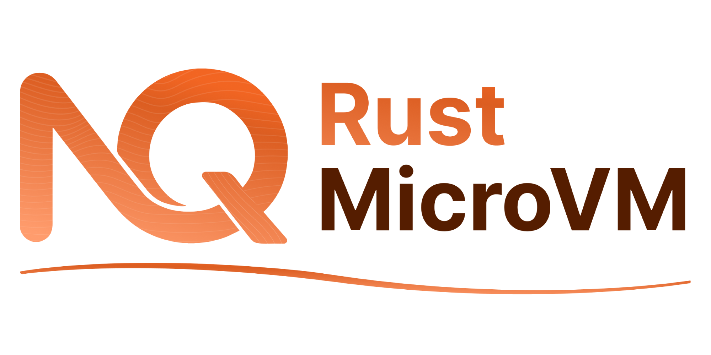
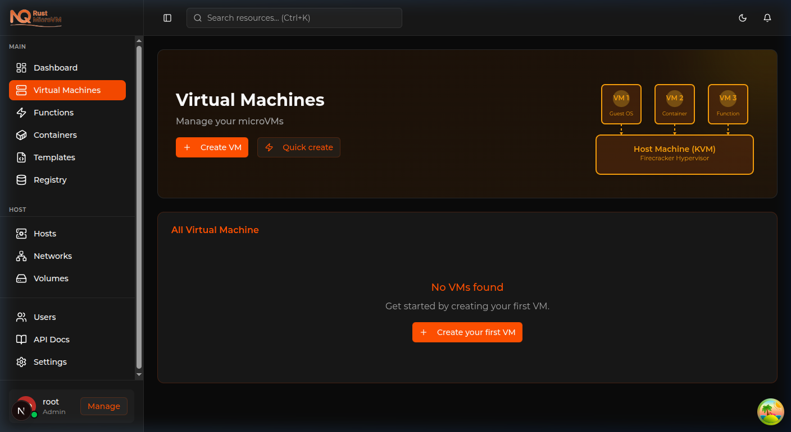
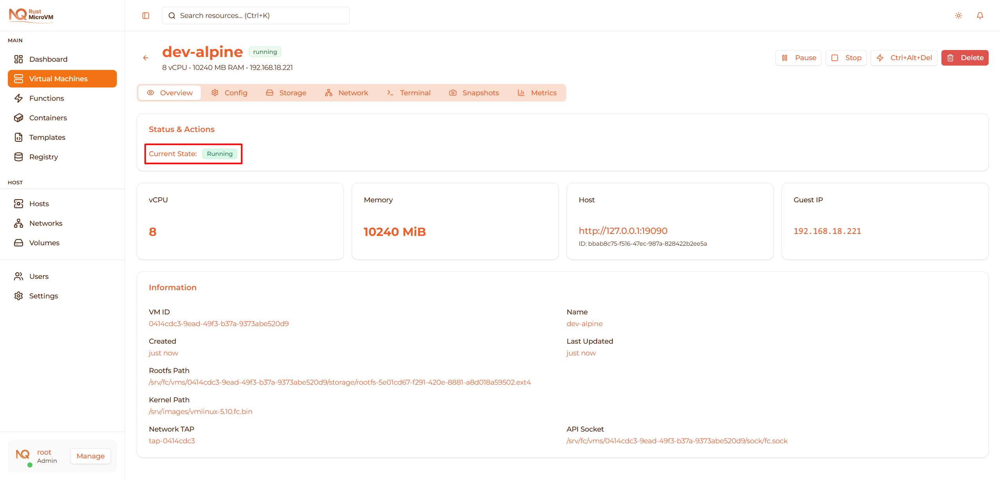
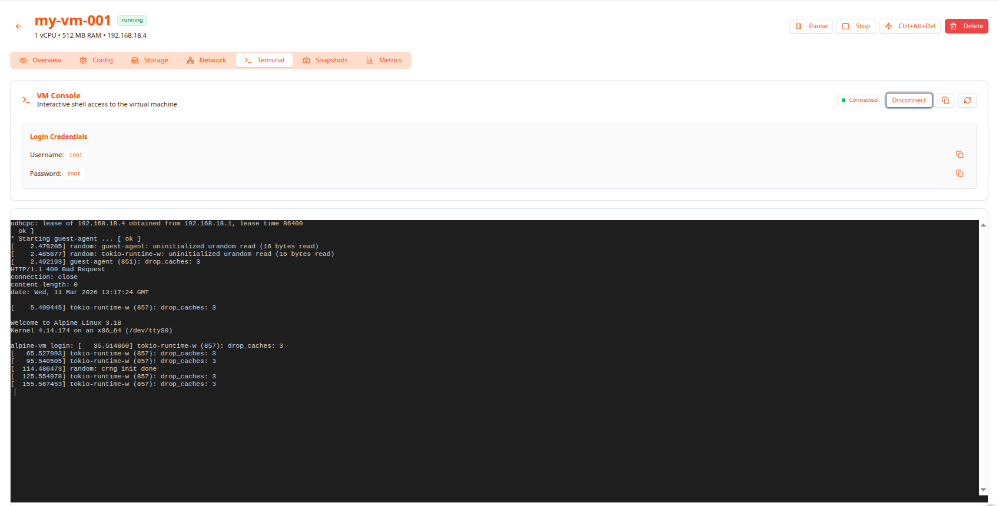
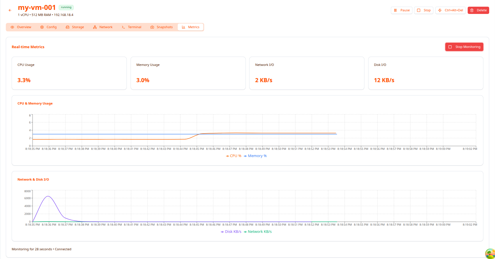
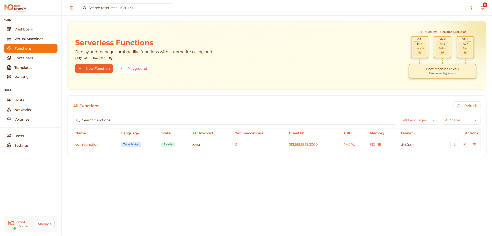
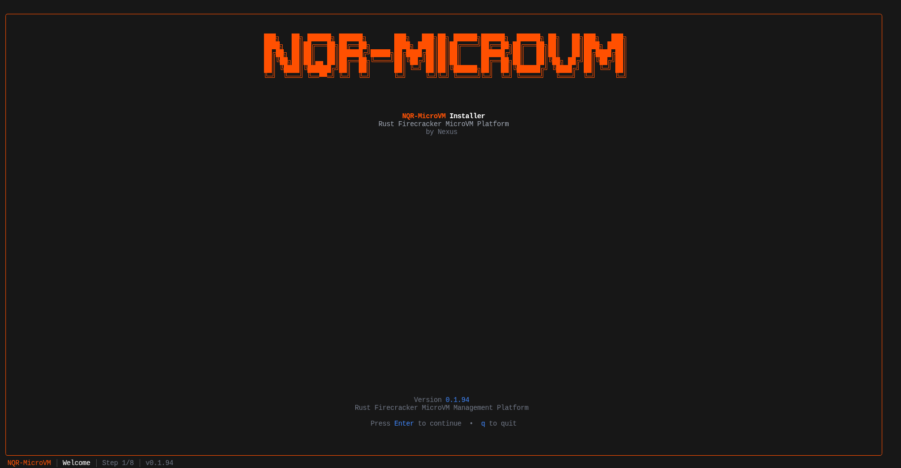
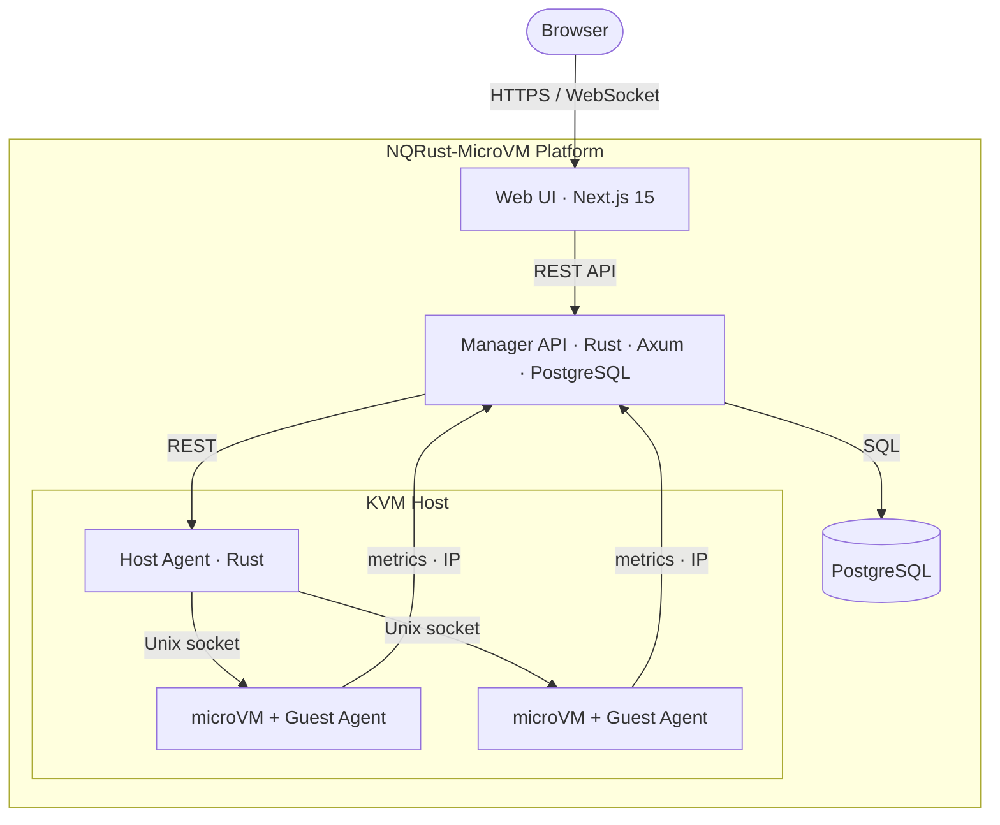

<div align="center">



<br/><br/>

**A self-hosted cloud platform powered by Firecracker microVMs**

Boot Linux VMs in under 125ms · Docker containers with hardware isolation<br/>
Serverless functions · Web terminal · Real-time metrics · No cloud dependency

<p>
  <a href="https://www.rust-lang.org/"></a>
  <a href="https://nextjs.org/"></a>
  <a href="https://firecracker-microvm.github.io/"></a>
  <a href="LICENSE"></a>
</p>

[**Install →**](#installation) · [**Documentation**](docs/) · [**API Reference**](#api-reference) · [**Report a Bug**](https://github.com/NexusQuantum/NQRust-MicroVM/issues)

</div>

---

## Screenshots

<table>
  <tr>
    <td width="50%"></td>
    <td width="50%"></td>
  </tr>
  <tr>
    <td align="center"><sub>Virtual Machines — create, manage, and monitor all your microVMs</sub></td>
    <td align="center"><sub>VM detail — 7-tab interface: overview, terminal, metrics, storage, network, snapshots, config</sub></td>
  </tr>
  <tr>
    <td></td>
    <td></td>
  </tr>
  <tr>
    <td align="center"><sub>Browser-based xterm.js shell — no SSH client needed</sub></td>
    <td align="center"><sub>Live CPU, memory, network, and disk graphs over WebSocket</sub></td>
  </tr>
  <tr>
    <td></td>
    <td></td>
  </tr>
  <tr>
    <td align="center"><sub>Serverless functions — Monaco editor, live execution logs, playground</sub></td>
    <td align="center"><sub>One-command TUI installer — guided setup, online and airgapped</sub></td>
  </tr>
</table>

---

## Overview

**NQRust-MicroVM** is a production-ready platform for running [Firecracker](https://firecracker-microvm.github.io/) microVMs on your own Linux hardware. Three Rust services and a Next.js 15 frontend — installed in one command.

**Virtual Machines** — Isolated Linux VMs with their own kernel, rootfs, CPU/memory limits, and storage volumes. Browser terminal. Snapshots. Templates for one-click re-deployment.

**Containers** — Docker workloads running *inside* Firecracker VMs. Full Docker API compatibility with hardware-level kernel isolation underneath — container escape is structurally impossible.

**Serverless Functions** — Node.js, Python, or Ruby functions that execute on demand in isolated VMs. Webhook-ready with a built-in code editor and execution playground.

---

## Features

| | Feature | Details |
|---|---|---|
| ⚡ | **Sub-125ms Boot** | Firecracker starts Linux VMs faster than most processes |
| 🖥️ | **Web Terminal** | Full xterm.js shell in the browser via WebSocket — no SSH client needed |
| 📊 | **Real-time Metrics** | Live CPU, memory, network, and disk graphs streamed over WebSocket |
| 🐳 | **Isolated Containers** | Docker-in-VM with full Docker API — hardware-level kernel isolation |
| ⚡ | **Serverless Functions** | Node.js, Python, Ruby — Monaco editor, live logs, interactive playground |
| 📸 | **Snapshots** | Full and differential VM snapshots with instant restore |
| 📦 | **Image Registry** | Kernels, rootfs, and Docker images — import from URL, local path, or DockerHub |
| 🌐 | **Flexible Networking** | NAT, Isolated, Bridged, and VXLAN overlay networks |
| 🔀 | **Port Forwarding** | Route external traffic to services running inside VMs |
| 🏢 | **Multi-Host Clustering** | Add agent nodes to a shared manager — scale across physical machines |
| 👥 | **RBAC** | Admin / User / Viewer roles, resource ownership, per-user preferences |
| 📋 | **Templates** | Save VM configurations for one-click re-deployment |
| 🔒 | **TUI Installer** | Guided Rust installer — online and fully airgapped, manages systemd services |

---

## Architecture

Four lightweight components coordinate to run your workloads:

| Component | Role | Port |
|---|---|---|
| **Manager** | Central API — VM lifecycle, image registry, networking, storage, RBAC | 18080 |
| **Agent** | Runs on each KVM host, executes Firecracker operations via Unix socket | 9090 |
| **Guest Agent** | Tiny static binary auto-deployed inside every VM, reports metrics and IP | 9000 |
| **Web UI** | Next.js 15 / React 19 dashboard — terminal, metrics, full management | 3000 |


```mermaid
graph TD
    Browser([Browser])

    subgraph Platform["NQRust-MicroVM Platform"]
        UI["Web UI · Next.js 15"]
        Manager["Manager API · Rust · Axum · PostgreSQL"]
        DB[("PostgreSQL")]

        subgraph Host["KVM Host"]
            Agent["Host Agent · Rust"]
            VM1["microVM + Guest Agent"]
            VM2["microVM + Guest Agent"]
        end
    end

    Browser -->|"HTTPS / WebSocket"| UI
    UI -->|"REST API"| Manager
    Manager -->|"SQL"| DB
    Manager -->|"REST"| Agent
    Agent -->|"Unix socket"| VM1
    Agent -->|"Unix socket"| VM2
    VM1 -->|"metrics · IP"| Manager
    VM2 -->|"metrics · IP"| Manager
```

### Network Types

| Type | Description | Best for |
|---|---|---|
| **NAT** | Private subnet, internet via host NAT | Most workloads |
| **Isolated** | Private subnet, no external access | Air-gapped services |
| **Bridged** | VMs appear directly on your LAN | Direct network visibility |
| **VXLAN** | Multi-host overlay tunnel | VMs across physical machines |

---

## Installation

The `nqr-installer` is a guided Rust TUI that provisions everything — KVM access, networking bridge, PostgreSQL, systemd services, and platform configuration.

### Online

```bash
curl -fsSL https://github.com/NexusQuantum/NQRust-MicroVM/releases/latest/download/install.sh | sudo bash
```

### Airgapped

```bash
# On a connected machine — download the installer binary
curl -fsSL -o nqr-installer \
  https://github.com/NexusQuantum/NQRust-MicroVM/releases/latest/download/nqr-installer-x86_64-linux-musl
chmod +x nqr-installer

# Transfer to the target host and run
scp nqr-installer user@target-host:/tmp/
ssh user@target-host sudo /tmp/nqr-installer install
```

The TUI walks through mode selection, network configuration, pre-flight checks, and live installation progress. Full walkthrough: [Installation Guide](docs/content/docs/getting-started/installation.md).

### Installation Modes

| Mode | Components | Use case |
|---|---|---|
| **Production** | Manager + Agent + UI | Single host, all-in-one |
| **Manager Only** | Manager | Control plane in a multi-host setup |
| **Agent Only** | Agent | Worker node joining an existing manager |
| **Minimal** | Manager + Agent | Headless / no web UI |

### System Requirements

| | Minimum | Recommended |
|---|---|---|
| **CPU** | x86_64 with KVM (Intel VT-x / AMD-V) | — |
| **RAM** | 4 GB | 8 GB+ |
| **Disk** | 20 GB free | 50 GB+ |
| **OS** | Ubuntu 22.04, Debian 11 | Ubuntu 24.04 LTS |

### Default Credentials

After installation, open `http://<host>:3000` and log in with **`root` / `root`**. Change the password immediately via **Settings → Account**.

---

## Quick Start

### Create your first VM

1. Open **Registry** → import a kernel and rootfs (URL, local path, or DockerHub)
2. Go to **Virtual Machines → Create VM** and follow the 6-step wizard
3. Click the **Terminal** tab for instant browser-based shell access
4. Explore **Metrics** for live CPU, memory, network, and disk graphs

### Deploy a serverless function

1. Go to **Functions → New Function**
2. Choose a runtime (Node.js, Python, Ruby) and write code in the Monaco editor
3. Use the **Playground** to send test payloads and view live execution logs

### Run a Docker container

1. Go to **Containers → New Container**
2. Enter any Docker image name — the platform provisions a dedicated Firecracker VM with Docker runtime
3. Each container runs in complete VM isolation with its own kernel

---

## API Reference

Interactive Swagger UI is available while the manager is running:

```
http://<host>:18080/swagger-ui/
```

Every operation available in the UI is also accessible via the REST API.

---

## Development

See [CLAUDE.md](CLAUDE.md) for full development setup, architecture details, and code conventions.

```bash
# Start PostgreSQL
./scripts/dev-up.sh

# Build all services
cargo build

# Start the frontend dev server
cd apps/ui && pnpm install && pnpm dev
```

Default dev URLs: UI at `http://localhost:3000`, Manager API at `http://localhost:18080`.

---

## Contributing

1. Fork the repository
2. Create a feature branch: `git checkout -b feature/your-feature`
3. Commit your changes: `git commit -m 'Add your feature'`
4. Push and open a Pull Request

---

## License

Distributed under the **GNU Affero General Public License v3.0**. See [LICENSE](LICENSE) for details.

<div align="center">
  <sub>Built with Rust and caffeine by the <b>Nexus</b> team.</sub>
</div>
