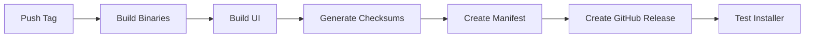

# Release Guide

This document describes how to create and publish new releases of NQRust-MicroVM.

## Table of Contents

- [Release Process Overview](#release-process-overview)
- [Prerequisites](#prerequisites)
- [Creating a Release](#creating-a-release)
- [What Happens During Release](#what-happens-during-release)
- [Release Artifacts](#release-artifacts)
- [Testing a Release](#testing-a-release)
- [Versioning Guidelines](#versioning-guidelines)
- [Troubleshooting](#troubleshooting)

## Release Process Overview

NQRust-MicroVM uses automated GitHub Actions workflows to build, package, and distribute releases. The process is triggered by pushing a version tag to the repository.



## Prerequisites

Before creating a release, ensure:

1. **All tests pass**: Run the CI pipeline on the main branch
   ```bash
   git push origin main
   # Wait for CI to pass at: https://github.com/NexusQuantum/NQRust-MicroVM/actions
   ```

2. **Update CHANGELOG.md**: Document all changes since the last release
   ```markdown
   ## [1.1.0] - 2025-11-13
   ### Added
   - New feature X
   ### Fixed
   - Bug Y
   ```

3. **Version numbers are updated** (if applicable):
   - `Cargo.toml` files for Rust components
   - `package.json` for UI component

4. **You have push permissions** to the repository

## Creating a Release

### Method 1: Automated (Recommended)

1. **Commit and push all changes**:
   ```bash
   git add .
   git commit -m "Prepare release v1.1.0"
   git push origin main
   ```

2. **Create and push a version tag**:
   ```bash
   # Tag format: v<major>.<minor>.<patch>
   git tag v1.1.0
   git push origin v1.1.0
   ```

3. **Monitor the release workflow**:
   - Navigate to: https://github.com/NexusQuantum/NQRust-MicroVM/actions
   - Find the "Release" workflow run
   - Wait for completion (~15-20 minutes)

### Method 2: Manual Trigger

You can also trigger a release manually from GitHub Actions:

1. Go to: https://github.com/NexusQuantum/NQRust-MicroVM/actions/workflows/release.yml
2. Click "Run workflow"
3. Enter the version (e.g., `v1.1.0`)
4. Click "Run workflow"

## What Happens During Release

The release workflow ([.github/workflows/release.yml](.github/workflows/release.yml)) performs the following steps:

### 1. Build Binaries Job

Builds all Rust components:

```yaml
- Manager binary (x86_64-linux-musl)
- Agent binary (x86_64-linux-musl)
- Guest-agent binary (x86_64-unknown-linux-musl, static)
```

**Output files**:
- `nqrust-manager-x86_64-linux-musl`
- `nqrust-agent-x86_64-linux-musl`
- `nqrust-guest-agent-x86_64-linux-musl`

### 2. Build UI Job

Builds the Next.js UI:

```bash
cd apps/ui
pnpm install --frozen-lockfile
pnpm build
```

**Output**: `nqrust-ui.tar.gz` containing:
- `.next/` - Built Next.js application
- `public/` - Static assets
- `package.json` - Dependencies manifest
- `next.config.js` - Next.js configuration
- `pnpm-lock.yaml` - Lockfile

### 3. Create Release Job

Generates release artifacts:

#### a. Generate Checksums

Creates SHA256 checksums for all binaries:

```bash
sha256sum nqrust-manager-* > checksums.txt
sha256sum nqrust-agent-* >> checksums.txt
sha256sum nqrust-guest-agent-* >> checksums.txt
sha256sum nqrust-ui.tar.gz >> checksums.txt
```

#### b. Create Release Manifest

Generates `release-manifest.json` for the auto-updater:

```json
{
  "version": "v1.1.0",
  "released_at": "2025-11-13T12:34:56Z",
  "min_compatible_version": "v1.0.0",
  "changelog": "See CHANGELOG.md for details",
  "components": {
    "manager": {
      "version": "v1.1.0",
      "url": "https://github.com/NexusQuantum/NQRust-MicroVM/releases/download/v1.1.0/nqrust-manager-x86_64-linux-musl",
      "checksum": "abc123...",
      "size": 12345678
    },
    "agent": { /* ... */ },
    "guest-agent": { /* ... */ },
    "ui": { /* ... */ }
  },
  "migrations": {
    "from": "v1.0.0",
    "requires_downtime": false,
    "breaking_changes": false
  }
}
```

#### c. Create GitHub Release

Creates a new GitHub Release with:
- Release notes with installation instructions
- All binary artifacts
- Checksums file
- Release manifest

### 4. Test Installer Job

Tests the installer in multiple modes:
- Production mode
- Development mode
- Manager-only mode
- Agent-only mode

Verifies:
- Services start successfully
- Health endpoints respond
- Uninstaller works correctly

## Release Artifacts

Each release includes the following downloadable artifacts:

| File | Description | Size |
|------|-------------|------|
| `nqrust-manager-x86_64-linux-musl` | Manager service binary | ~20MB |
| `nqrust-agent-x86_64-linux-musl` | Agent service binary | ~15MB |
| `nqrust-guest-agent-x86_64-linux-musl` | Guest agent (static) | ~5MB |
| `nqrust-ui.tar.gz` | Next.js UI bundle | ~50MB |
| `checksums.txt` | SHA256 checksums | <1KB |
| `release-manifest.json` | Auto-updater manifest | <1KB |

### Download URLs

Artifacts are available at:
```
https://github.com/NexusQuantum/NQRust-MicroVM/releases/download/v1.1.0/<filename>
```

### Verifying Downloads

Always verify checksums after downloading:

```bash
# Download binary
wget https://github.com/NexusQuantum/NQRust-MicroVM/releases/download/v1.1.0/nqrust-manager-x86_64-linux-musl

# Download checksums
wget https://github.com/NexusQuantum/NQRust-MicroVM/releases/download/v1.1.0/checksums.txt

# Verify
sha256sum -c checksums.txt --ignore-missing
```

## Testing a Release

### Automated Testing

The release workflow automatically tests the installer on:
- Ubuntu 22.04
- Multiple installation modes
- Service health checks
- Uninstallation

View test results in the GitHub Actions run.

### Manual Testing

To manually test a release:

#### 1. Test Quick Install (Production Mode)

```bash
# On a clean Ubuntu 22.04 VM
curl -fsSL https://raw.githubusercontent.com/NexusQuantum/NQRust-MicroVM/main/scripts/install/install.sh | sudo bash
```

#### 2. Test Manual Install

```bash
# Download installer
curl -LO https://raw.githubusercontent.com/NexusQuantum/NQRust-MicroVM/main/scripts/install/install.sh
chmod +x install.sh

# Install with specific version
sudo RELEASE_VERSION=v1.1.0 ./install.sh --mode production --non-interactive
```

#### 3. Verify Installation

```bash
# Check services
systemctl status nqrust-manager
systemctl status nqrust-agent
systemctl status nqrust-ui

# Check health endpoints
curl http://localhost:18080/health
curl http://localhost:19090/health

# Access UI
curl http://localhost:3000
```

#### 4. Create Test VM

```bash
# Via API
curl -X POST http://localhost:18080/v1/vms \
  -H "Content-Type: application/json" \
  -d '{
    "name": "test-vm",
    "vcpu_count": 1,
    "mem_size_mib": 512
  }'

# Via UI
open http://localhost:3000/vms
```

#### 5. Test Upgrade Path

If testing upgrade from previous version:

```bash
# Install old version first
sudo RELEASE_VERSION=v1.0.0 ./install.sh --mode production

# Then upgrade
sudo RELEASE_VERSION=v1.1.0 ./install.sh --mode production

# Verify VMs still exist
curl http://localhost:18080/v1/vms
```

## Versioning Guidelines

NQRust-MicroVM follows [Semantic Versioning](https://semver.org/) (SemVer):

### Version Format: `vMAJOR.MINOR.PATCH`

- **MAJOR** (v2.0.0): Breaking API changes, database incompatibility
- **MINOR** (v1.1.0): New features, backward-compatible
- **PATCH** (v1.0.1): Bug fixes, backward-compatible

### Examples

| Version | Type | Description |
|---------|------|-------------|
| v1.0.0 | Initial | First stable release |
| v1.0.1 | Patch | Fix agent crash on VM delete |
| v1.1.0 | Minor | Add template feature |
| v2.0.0 | Major | New database schema, API v2 |

### Pre-release Versions

For testing and development:

```bash
v1.1.0-alpha.1    # Alpha release
v1.1.0-beta.1     # Beta release
v1.1.0-rc.1       # Release candidate
```

### Version Compatibility

The release manifest includes compatibility information:

```json
{
  "min_compatible_version": "v1.0.0",
  "migrations": {
    "from": "v1.0.0",
    "requires_downtime": false,
    "breaking_changes": false
  }
}
```

## User Installation

End users can install NQRust-MicroVM in several ways:

### Quick Install (Latest Version)

```bash
curl -fsSL https://raw.githubusercontent.com/NexusQuantum/NQRust-MicroVM/main/scripts/install/install.sh | sudo bash
```

### Install Specific Version

```bash
curl -fsSL https://raw.githubusercontent.com/NexusQuantum/NQRust-MicroVM/main/scripts/install/install.sh | \
  sudo RELEASE_VERSION=v1.1.0 bash
```

### Install with Options

```bash
sudo RELEASE_VERSION=v1.1.0 ./install.sh \
  --mode production \
  --network-mode nat \
  --with-ui
```

### Installation Modes

| Mode | Components | Use Case |
|------|------------|----------|
| `production` | Manager + Agent + UI | Full installation (default) |
| `dev` | Build from source | Development |
| `manager` | Manager + UI only | Control plane |
| `agent` | Agent only | Worker node |
| `minimal` | Manager + Agent | No UI |

## Troubleshooting

### Release Workflow Failed

#### Build Errors

```bash
# Check build logs in GitHub Actions
# Common issues:
- Dependency version conflicts → Update Cargo.lock
- Missing system packages → Update workflow dependencies
- Compilation errors → Fix code, push, re-tag
```

#### Test Failures

```bash
# Installer test failed
- Check test logs in GitHub Actions
- Reproduce locally: sudo bash scripts/install/install.sh
- Fix issues, push, delete tag, re-tag
```

#### Tag Already Exists

```bash
# Delete remote tag
git push origin --delete v1.1.0

# Delete local tag
git tag -d v1.1.0

# Create new tag
git tag v1.1.0
git push origin v1.1.0
```

### Installer Issues

#### Download Fails

```bash
# Error: Could not determine latest version
# Fix: Ensure release was created successfully
# Check: https://github.com/NexusQuantum/NQRust-MicroVM/releases

# Error: 404 Not Found
# Fix: Verify release tag matches RELEASE_VERSION
# Check: Release must be published, not draft
```

#### Checksum Mismatch

```bash
# Error: Checksum verification failed
# Fix: Re-download the file
# Or: Download from GitHub web interface
```

#### Service Start Failures

```bash
# Check service logs
journalctl -u nqrust-manager -n 100
journalctl -u nqrust-agent -n 100

# Common issues:
- Database connection → Check PostgreSQL
- Port conflicts → Check ports 18080, 19090, 3000
- Permissions → Check /srv/fc ownership
```

### Rollback a Release

If a release has critical issues:

1. **Mark release as pre-release**:
   - Go to: https://github.com/NexusQuantum/NQRust-MicroVM/releases
   - Edit the release
   - Check "This is a pre-release"

2. **Create hotfix release**:
   ```bash
   # Fix the issue
   git commit -m "hotfix: critical bug"

   # Create patch release
   git tag v1.1.1
   git push origin v1.1.1
   ```

3. **Notify users**:
   - Update release notes with warning
   - Post announcement if needed

## CI/CD Pipeline Reference

### Workflows

| Workflow | Trigger | Purpose |
|----------|---------|---------|
| [ci.yml](.github/workflows/ci.yml) | Push, PR | Continuous integration |
| [release.yml](.github/workflows/release.yml) | Tag push | Build and release |
| [test-installer.yml](.github/workflows/test-installer.yml) | Manual, Schedule | Test installer |

### Secrets Required

None currently. All workflows use:
- `GITHUB_TOKEN` (automatic)

### Caching

Workflows cache:
- Cargo registry and build artifacts
- pnpm store and node_modules
- Reduces build time by ~5-10 minutes

## Post-Release Checklist

After creating a release:

- [ ] Verify release appears on [GitHub Releases page](https://github.com/NexusQuantum/NQRust-MicroVM/releases)
- [ ] Test quick install command on clean VM
- [ ] Update documentation links if needed
- [ ] Announce release (if major/minor version)
- [ ] Monitor issue tracker for bug reports
- [ ] Plan next release milestones

## Future Enhancements

Planned improvements to the release process:

- [ ] Automatic changelog generation from git commits
- [ ] Docker images published to Docker Hub
- [ ] RPM/DEB package generation
- [ ] Homebrew formula for macOS
- [ ] Windows installer (WSL2 support)
- [ ] Release candidate workflow
- [ ] Multi-arch builds (ARM64)

## Resources

- [GitHub Releases Documentation](https://docs.github.com/en/repositories/releasing-projects-on-github)
- [Semantic Versioning](https://semver.org/)
- [GitHub Actions Workflow Syntax](https://docs.github.com/en/actions/using-workflows/workflow-syntax-for-github-actions)
- [softprops/action-gh-release](https://github.com/softprops/action-gh-release) - Release action used

## Support

For issues with releases:
- Open an issue: https://github.com/NexusQuantum/NQRust-MicroVM/issues
- Check existing releases: https://github.com/NexusQuantum/NQRust-MicroVM/releases
- View workflow runs: https://github.com/NexusQuantum/NQRust-MicroVM/actions
