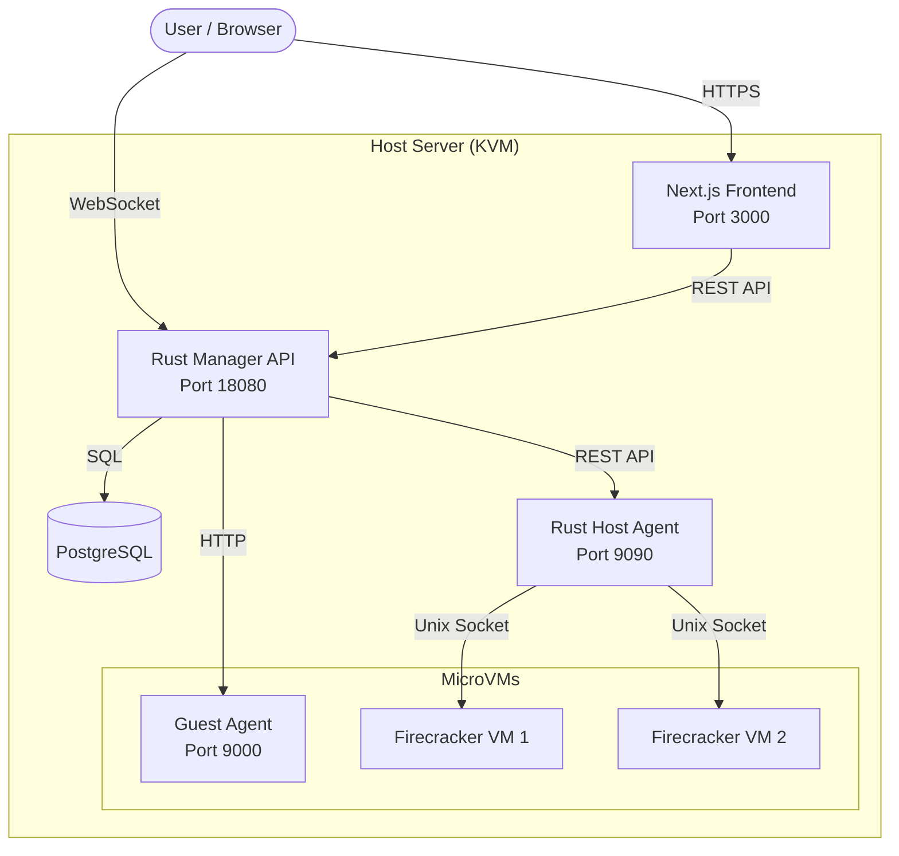

+++
title = "Introduction"
description = "Overview of NQRust-MicroVM architecture and key concepts"
weight = 1
sort_by = "weight"
template = "section.html"
page_template = "page.html"
+++

# Introduction to NQRust-MicroVM

**NQRust-MicroVM** is a modern, high-performance management system for AWS Firecracker microVMs. It provides a complete platform for managing lightweight virtual machines, Docker containers, and serverless functions with a focus on security, performance, and ease of use.

## What is NQRust-MicroVM?

NQRust-MicroVM bridges the gap between raw KVM processes and a usable cloud platform. Designed for home labs, private clouds, and edge deployments, it offers an intuitive web dashboard to spin up virtual machines in milliseconds with minimal resource overhead.

### Key Differentiators

- **Firecracker-First**: Built specifically for AWS Firecracker, not a generic VM manager
- **Modern Stack**: Rust backend for safety and performance, Next.js 15 frontend for UX
- **Security by Default**: Strong kernel-level isolation via Firecracker microVMs
- **Developer Friendly**: Web terminal, real-time metrics, comprehensive API
- **Hybrid Architecture**: Supports VMs, containers, and serverless functions in one platform

---

## Architecture Overview

The system consists of four main components:

### Manager (Port 18080)
The **central orchestration service** managing VM lifecycle, containers, and functions.

- **Technology**: Rust with Axum web framework
- **Database**: PostgreSQL with SQLx ORM
- **Features**:
  - VM lifecycle management (create, start, stop, pause, resume, delete)
  - Docker container orchestration (container-per-VM architecture)
  - Serverless function execution (Node.js, Python, Ruby)
  - Image registry (kernels, rootfs, container runtimes)
  - Snapshot and template management
  - WebSocket support (shell access, real-time metrics)
  - Background reconciler for health monitoring

### Agent (Port 9090)
**Runs on KVM hosts** to execute VM operations via Firecracker.

- **Technology**: Rust with Axum
- **Requires**: Root privileges for KVM access
- **Functions**:
  - Registers with manager on startup
  - Sends periodic heartbeats
  - Communicates with Firecracker VMM via Unix domain sockets
  - Handles VM creation, lifecycle, snapshots
  - Proxies shell access via screen sessions

### Guest Agent (Port 9000)
**Runs inside VMs** to report metrics and status back to the manager.

- **Technology**: Rust (statically compiled with musl)
- **Auto-deployed**: Manager installs it during VM creation
- **Functions**:
  - Reports CPU, memory, uptime, load average, process count
  - Auto-reports VM IP address to manager
  - Enables real-time guest metrics via WebSocket

### Frontend UI (Port 3000)
**Modern web interface** for managing the entire platform.

- **Technology**: Next.js 15, React 19, TypeScript
- **UI Framework**: shadcn/ui with Tailwind CSS 4
- **State Management**: TanStack Query (React Query)
- **Real-time**: WebSocket for terminal and metrics
- **Features**:
  - VM management with 7-tab detail view
  - Container and function management
  - Image registry with DockerHub browser
  - Host, network, and volume registries
  - Browser-based terminal (xterm.js)
  - Real-time metrics dashboards

---

## Component Communication

---

## Key Concepts

### MicroVMs vs Containers

**Firecracker microVMs** provide:
- Full kernel isolation (each VM runs its own Linux kernel)
- Hardware virtualization via KVM
- Boot times under 125ms
- Memory overhead as low as 5MB per VM
- Stronger security than containers alone

**Container Mode** runs Docker inside microVMs for:
- Maximum isolation (kernel + hardware virtualization)
- Familiar Docker workflow
- Protection against container escape vulnerabilities

### VM Lifecycle States

- **Creating**: VM configuration being prepared
- **Created**: Ready to start but not running
- **Running**: VM is active and accessible
- **Paused**: VM execution suspended (memory preserved)
- **Stopped**: VM gracefully shut down
- **Failed**: VM encountered an error

### Templates

**VM Templates** allow you to save complete VM configurations for reuse:
- Hardware settings (CPU, memory)
- Boot source (kernel, rootfs, boot args)
- Network configuration
- Drive attachments

See [Templates Documentation](/user-guide/vm-management/templates/) for details.

### Snapshots

**Snapshots** capture the complete state of a running VM:
- **Full snapshots**: Complete memory and disk state
- **Differential snapshots**: Only changes since last snapshot
- **Instant restore**: Resume from snapshot in milliseconds

See [Snapshots Guide](/user-guide/vm-management/snapshots/) for details.

---

## Network Architecture

NQRust-MicroVM supports flexible networking:

### NAT Mode (Default)
- VMs connected to bridge (default: `fcbr0`)
- Isolated from LAN
- Outbound internet access via NAT
- Easy setup, no network configuration required

### Bridged Mode
- VMs appear as physical devices on your LAN
- Can receive DHCP addresses from your router
- Accessible from other devices on network
- Requires bridge setup (see [Bridged Networking](/operations/bridged-networking/))

### VLAN Support
- 802.1Q VLAN tagging
- Isolate VM traffic on separate VLANs
- Network registry with auto-registration
- See [Networking Guide](/user-guide/networking/)

---

## Storage Architecture

### Volume Types
- **rootfs**: Root filesystem (required for boot)
- **data**: Additional data volumes
- **Formats**: ext4, qcow2, raw

### Image Registry
Central registry for:
- **Kernels**: Linux kernel binaries
- **Rootfs**: Root filesystem images
- **Container Runtimes**: Alpine + Docker images

**Image Sources**:
- Local file upload
- Docker Hub browser
- Direct file paths (if enabled)

See [Storage Documentation](/user-guide/storage/) for details.

---

## Security Model

### Isolation Layers

1. **Hardware Virtualization**: KVM-based isolation
2. **Minimal Attack Surface**: Firecracker has tiny TCB (Trusted Computing Base)
3. **Process Isolation**: Each VM is a separate Linux process
4. **Network Isolation**: VMs can be network-isolated or VLAN-tagged
5. **RBAC**: Role-based access control for multi-user environments (in development)

### Auto-Authentication

VMs receive auto-generated credentials via:
- **MMDS** (Microvm Metadata Service): Firecracker's metadata service
- **cloud-init**: Standard cloud initialization
- Credentials accessible in VM at boot time

---

## What's Next?

- [**Getting Started**](/getting-started/) - Install and run your first VM
- [**User Guide**](/user-guide/) - Learn about all features
- [**Operations**](/operations/) - Production deployment and tuning
- [**API Reference**](http://localhost:18080/swagger-ui/) - REST API documentation

---

## Project Status

NQRust-MicroVM is under active development. Key features are production-ready:

**Production Ready:**
- VM lifecycle management
- Web terminal and metrics
- Snapshots and templates
- Networking (NAT and bridged)
- Volume management
- Container orchestration
- Serverless functions

**In Development:**
- Full RBAC implementation
- Multi-tenancy
- Advanced monitoring
- Cluster orchestration

See [Project Roadmap](/project/roadmap/) for future plans.
