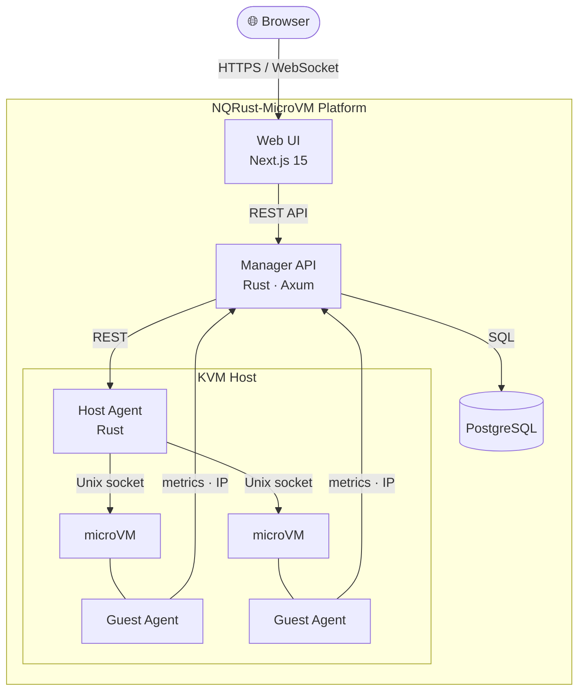

+++
title = "Introduction"
description = "NQRust-MicroVM — self-hosted microVM platform for VMs, containers, and serverless functions"
icon = "rocket_launch"
weight = 10
layout = "single"
toc = true
+++

  

**NQRust-MicroVM** is a self-hosted platform for running and managing lightweight virtual machines, Docker containers, and serverless functions on your own Linux hardware — with a full web dashboard, REST API, browser-based terminal, and real-time metrics.

{}
VMs boot in under 125 ms with as little as 5 MB overhead each. The platform runs entirely on your infrastructure — no cloud dependency, no vendor lock-in.
{}

---

## What You Can Run

### Virtual Machines
Spin up isolated Linux VMs instantly. Each VM gets its own kernel, root filesystem, CPU and memory limits, network interface, and storage volumes. Access them through the built-in web terminal. Capture state with snapshots. Save reusable configurations as templates.

### Containers
Deploy Docker containers that run **inside** VMs — combining the familiar Docker workflow with hardware-level kernel isolation underneath. Eliminates container escape risks entirely.

### Serverless Functions
Write and deploy Node.js, Python, or Ruby functions that execute on demand inside isolated VMs. Ideal for webhooks, automation, and event-driven tasks — without managing full servers.

---

## Platform Components

NQRust-MicroVM is three Rust services and a Next.js 15 frontend, orchestrated by the `nqr-installer`.

| Component | Role |
|---|---|
| **Manager** | Central API server — VM lifecycle, image registry, networking, storage, users, RBAC. Built on Axum + PostgreSQL. |
| **Agent** | Runs on each KVM host with root privileges. Translates Manager instructions into hypervisor operations. Multiple agents supported. |
| **Guest Agent** | Tiny static binary auto-deployed inside each VM. Reports CPU, memory, uptime, and IP address — no manual setup. |
| **Web UI** | Next.js 15 / React 19 dashboard served from the Manager host. Full xterm.js terminal, real-time metric graphs. |

---

## Architecture

---

## Key Features

{}
**Web Dashboard** — Manage VMs, containers, and functions entirely from the browser. No CLI required for day-to-day operations.
{}

{}
**REST API + Swagger** — Every action is API-accessible. Interactive Swagger UI available at `/swagger-ui/` on your Manager host.
{}

{}
**Real-time Terminal & Metrics** — Browser-based xterm.js shell into any running VM. Live CPU and memory graphs over WebSocket.
{}

{}
**Flexible Networking** — NAT, Isolated, Bridged, and VXLAN overlay networks provisioned automatically. Multi-host VXLAN lets VMs on different physical machines communicate transparently.
{}

{}
**RBAC** — Three roles: Admin (full access), User (own resources), and Viewer (read-only). Multi-user safe.
{}

---

## Network Types

| Type | Description | Best For |
|---|---|---|
| **NAT** | Private subnet, internet via host NAT | Most workloads |
| **Isolated** | Private subnet, no external access | Air-gapped / internal services |
| **Bridged** | VMs appear directly on your LAN | Direct network access |
| **VXLAN** | Multi-host overlay tunnel | VMs across multiple physical hosts |

---

## What's Next?

{}
**New here?** Head straight to the [Installation Guide](../getting-started/installation/) — the TUI installer gets you running in under 15 minutes.
{}

- **[Table of Contents](../table-of-contents/)** — Full index of all documentation sections
- **[Installation](../getting-started/installation/)** — Online and airgapped installer walkthrough
- **[Quick Start](../getting-started/quick-start/)** — Create your first VM after installation
- **[REST API](/swagger-ui/)** — Interactive API reference
