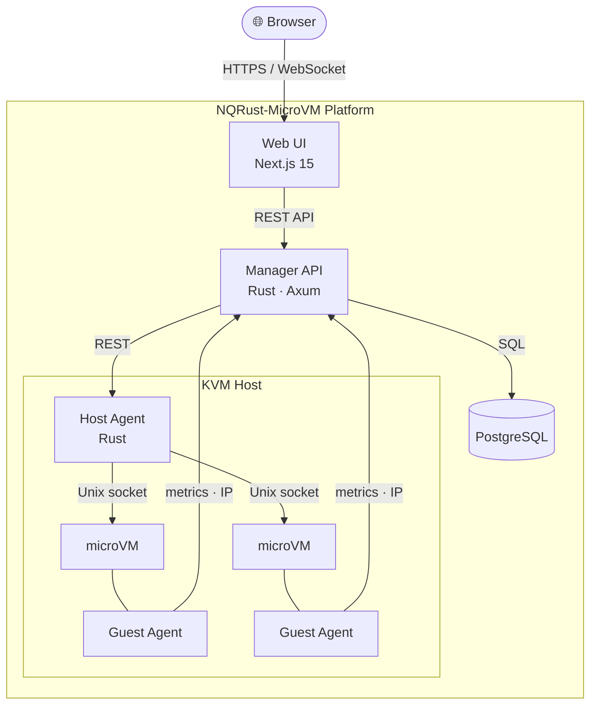

+++
title = "Pengenalan"
description = "NQRust-MicroVM — platform microVM yang dikelola sendiri untuk VM, container, dan fungsi serverless"
icon = "rocket_launch"
weight = 10
layout = "single"
toc = true
+++

  

**NQRust-MicroVM** adalah platform yang dikelola sendiri untuk menjalankan dan mengelola mesin virtual ringan, container Docker, dan fungsi serverless di perangkat keras Linux Anda sendiri — lengkap dengan dasbor web, REST API, terminal berbasis browser, dan metrik real-time.

{}
VM dapat boot dalam waktu kurang dari 125 ms dengan overhead serendah 5 MB per VM. Platform ini berjalan sepenuhnya di infrastruktur Anda — tanpa ketergantungan pada cloud, tanpa vendor lock-in.
{}

---

## Apa yang Dapat Dijalankan

### Mesin Virtual
Buat VM Linux yang terisolasi secara instan. Setiap VM mendapatkan kernel sendiri, filesystem root, batas CPU dan memori, antarmuka jaringan, dan volume penyimpanan. Akses melalui terminal web bawaan. Tangkap status dengan snapshot. Simpan konfigurasi yang dapat digunakan ulang sebagai template.

### Container
Deploy container Docker yang berjalan **di dalam** VM — menggabungkan alur kerja Docker yang familiar dengan isolasi kernel di level perangkat keras. Menghilangkan risiko container escape sepenuhnya.

### Fungsi Serverless
Tulis dan deploy fungsi Node.js, Python, atau Ruby yang dieksekusi sesuai permintaan di dalam VM yang terisolasi. Ideal untuk webhook, otomatisasi, dan tugas berbasis event — tanpa perlu mengelola server penuh.

---

## Komponen Platform

NQRust-MicroVM terdiri dari tiga layanan Rust dan frontend Next.js 15, yang diorkestrasikan oleh `nqr-installer`.

| Komponen | Peran |
|---|---|
| **Manager** | Server API pusat — siklus hidup VM, registri image, jaringan, penyimpanan, pengguna, RBAC. Dibangun di atas Axum + PostgreSQL. |
| **Agent** | Berjalan di setiap host KVM dengan hak akses root. Menerjemahkan instruksi Manager menjadi operasi hypervisor. Mendukung beberapa agent. |
| **Guest Agent** | Binary statis kecil yang di-deploy otomatis ke dalam setiap VM. Melaporkan CPU, memori, uptime, dan alamat IP — tanpa konfigurasi manual. |
| **Web UI** | Dasbor Next.js 15 / React 19 yang disajikan dari host Manager. Terminal xterm.js lengkap, grafik metrik real-time. |

---

## Arsitektur

---

## Fitur Utama

{}
**Dasbor Web** — Kelola VM, container, dan fungsi sepenuhnya dari browser. Tidak memerlukan CLI untuk operasi sehari-hari.
{}

{}
**REST API + Swagger** — Setiap tindakan dapat diakses melalui API. Swagger UI interaktif tersedia di `/swagger-ui/` pada host Manager Anda.
{}

{}
**Terminal & Metrik Real-time** — Shell xterm.js berbasis browser ke dalam VM yang sedang berjalan. Grafik CPU dan memori secara langsung melalui WebSocket.
{}

{}
**Jaringan Fleksibel** — Jaringan NAT, Isolated, Bridged, dan overlay VXLAN yang disediakan secara otomatis. VXLAN multi-host memungkinkan VM di mesin fisik berbeda berkomunikasi secara transparan.
{}

{}
**RBAC** — Tiga peran: Admin (akses penuh), User (sumber daya sendiri), dan Viewer (hanya baca). Aman untuk banyak pengguna.
{}

---

## Jenis Jaringan

| Jenis | Deskripsi | Terbaik Untuk |
|---|---|---|
| **NAT** | Subnet privat, akses internet melalui NAT host | Sebagian besar beban kerja |
| **Isolated** | Subnet privat, tanpa akses eksternal | Layanan air-gapped / internal |
| **Bridged** | VM tampil langsung di LAN Anda | Akses jaringan langsung |
| **VXLAN** | Terowongan overlay multi-host | VM di beberapa host fisik |

---

## Langkah Selanjutnya

{}
**Baru di sini?** Langsung menuju [Panduan Instalasi](../getting-started/installation/) — installer TUI akan membuat Anda siap berjalan dalam waktu kurang dari 15 menit.
{}

- **[Daftar Isi](../table-of-contents/)** — Indeks lengkap semua bagian dokumentasi
- **[Instalasi](../getting-started/installation/)** — Panduan installer online dan airgapped
- **[Quick Start](../getting-started/quick-start/)** — Buat VM pertama Anda setelah instalasi
- **[REST API](/swagger-ui/)** — Referensi API interaktif
